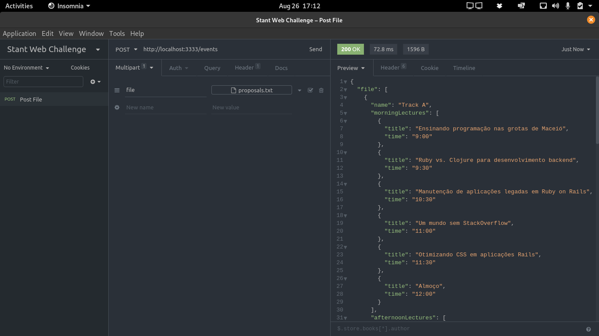

# 📅 Event Organizer 


## 📝 Description
Event Organizer is a Node.js REST API that convert a file with lectures and the time of each into an organized JSON with all days, sessions and hours.

### Endpoints
The application have only one endpoint __('/events' - POST Method)__, which get a file .txt by input and return a JSON by output.

## 🔗 Project dependencies
- Express (To create the server)
- Multer (To upload the .txt file)
- Sucrase (Transform newer JS syntax to older)
- Jest and Supertest (To implement TDD)
- Nodemon (Run server in development mode without need to restart for every change)

## 🚀 Run in your machine

Note: it requires yarn installed 

> Initial steps
```bash
$ git clone https://github.com/ruifernandees/event-organizer.git
$ cd event-organizer
# Install all dependencies
$ yarn install
```

> Run server (development mode)
```bash

# Start the server
$ yarn dev

```

> Prepare the files for the production environment
```bash

# Start the server
$ yarn build

```

> Run server (production environment)
```bash

# Start the server
$ yarn start

```

> Run tests
```bash

# Start the server
$ yarn test

```

## 💻 Demonstration


## ✅ Valid format
This API supports only the format of this file, which have a similar <a target="_blank" href="https://github.com/ruifernandees/event-organizer/blob/master/__test__/attach/proposals.txt">here</a>:

Diminuindo tempo de execução de testes em aplicações Rails enterprise 60min<br>
Reinventando a roda em ASP clássico 45min<br>
Apresentando Lua para as massas 30min<br>
Erros de Ruby oriundos de versões erradas de gems 45min<br>
Erros comuns em Ruby 45min<br>
Rails para usuários de Django lightning<br>
Trabalho remoto: prós e cons 60min<br>
Desenvolvimento orientado a gambiarras 45min<br>
Aplicações isomórficas: o futuro (que talvez nunca chegaremos) 30min<br>
Codifique menos, Escreva mais! 30min<br>
Programação em par 45min<br>
A mágica do Rails: como ser mais produtivo 60min<br>
Ruby on Rails: Por que devemos deixá-lo para trás 60min<br>
Clojure engoliu Scala: migrando minha aplicação 45min<br>
Ensinando programação nas grotas de Maceió 30min<br>
Ruby vs. Clojure para desenvolvimento backend 30min<br>
Manutenção de aplicações legadas em Ruby on Rails 60min<br>
Um mundo sem StackOverflow 30min<br>
Otimizando CSS em aplicações Rails 30min

Obs: Unfortunately, the API only works for that combination of time.

## 🔄 Response
```json
{
  "file": [
    {
      "name": "Track A",
      "morningLectures": [
        {
          "title": "Ensinando programação nas grotas de Maceió",
          "time": "9:00"
        },
        {
          "title": "Ruby vs. Clojure para desenvolvimento backend",
          "time": "9:30"
        },
        {
          "title": "Manutenção de aplicações legadas em Ruby on Rails",
          "time": "10:30"
        },
        {
          "title": "Um mundo sem StackOverflow",
          "time": "11:00"
        },
        {
          "title": "Otimizando CSS em aplicações Rails",
          "time": "11:30"
        },
        {
          "title": "Almoço",
          "time": "12:00"
        }
      ],
      "afternoonLectures": [
        {
          "title": "Codifique menos, Escreva mais!",
          "time": "13:00"
        },
        {
          "title": "Programação em par",
          "time": "13:45"
        },
        {
          "title": "A mágica do Rails: como ser mais produtivo",
          "time": "14:45"
        },
        {
          "title": "Ruby on Rails: Por que devemos deixá-lo para trás",
          "time": "15:45"
        },
        {
          "title": "Clojure engoliu Scala: migrando minha aplicação",
          "time": "16:30"
        },
        {
          "title": "Evento de networking",
          "time": "17:00"
        }
      ]
    },
    {
      "name": "Track B",
      "morningLectures": [
        {
          "title": "Diminuindo tempo de execução de testes em aplicações Rails enterprise",
          "time": "9:00"
        },
        {
          "title": "Reinventando a roda em ASP clássico",
          "time": "9:45"
        },
        {
          "title": "Apresentando Lua para as massas",
          "time": "10:15"
        },
        {
          "title": "Erros de Ruby oriundos de versões erradas de gems",
          "time": "11:00"
        },
        {
          "title": "Almoço",
          "time": "12:00"
        }
      ],
      "afternoonLectures": [
        {
          "title": "Erros comuns em Ruby",
          "time": "13:00"
        },
        {
          "title": "Rails para usuários de Django",
          "time": "13:05"
        },
        {
          "title": "Trabalho remoto: prós e cons",
          "time": "14:05"
        },
        {
          "title": "Desenvolvimento orientado a gambiarras",
          "time": "14:50"
        },
        {
          "title": "Aplicações isomórficas: o futuro (que talvez nunca chegaremos)",
          "time": "15:20"
        },
        {
          "title": "Evento de networking",
          "time": "17:00"
        }
      ]
    }
  ]
}
```